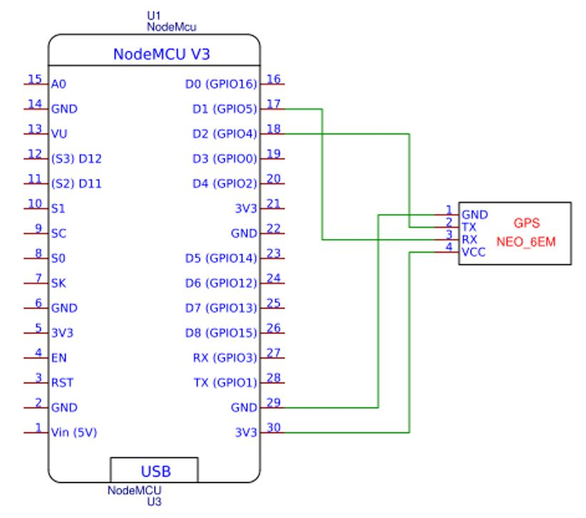
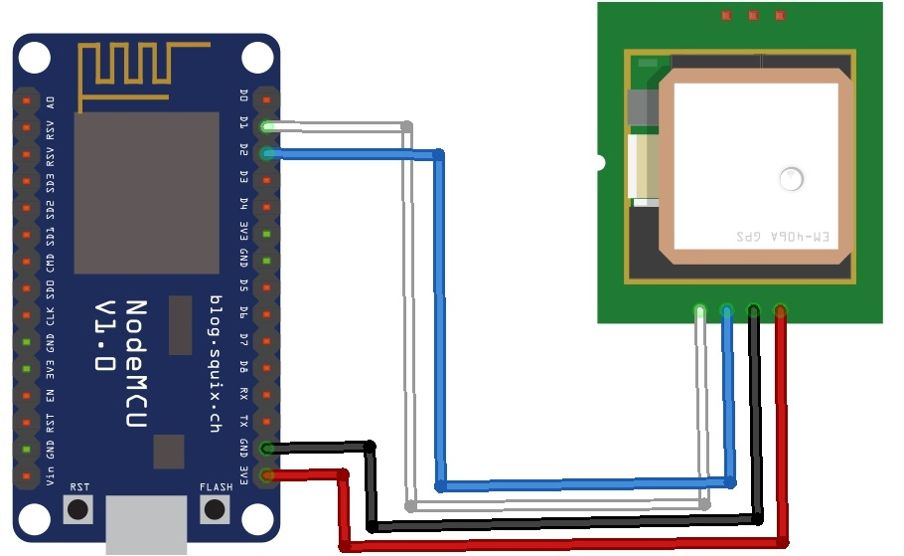
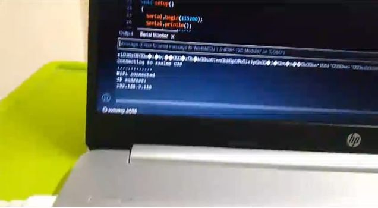
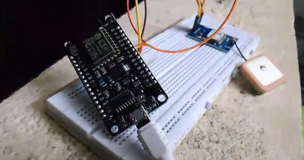
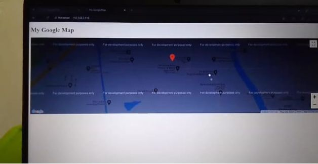

# Location Tracking System using NodeMCU & GPS
An IoT-based Location Tracking System using NodeMCU ESP8266 and GPS module that captures real-time coordinates and sends them via email using SMTP protocol. Designed for applications in personal safety, vehicle tracking, and asset monitoring.

## Overview

This project implements a real-time Location Tracking System using NodeMCU ESP8266 and a GPS module (NEO-6M). The system captures geographical coordinates (latitude and longitude) and sends them to a Gmail account using SMTP, allowing users to easily track the location through a Google Maps link.

This project demonstrates the practical implementation of IoT and embedded systems for real-world tracking applications.

---

## Architecture

The system consists of:

- NodeMCU ESP8266 (Wi-Fi microcontroller)
- GPS Module (NEO-6M)
- Email communication using SMTP protocol

---

## Block Diagram

---

## Circuit Diagram

---

## Hardware Components

- NodeMCU ESP8266  
- GPS Module (NEO-6M)  
- Breadboard  
- Connecting wires  
- Power supply  

---

## Working Principle

1. The GPS module receives signals from satellites  
2. Latitude and longitude are extracted  
3. NodeMCU reads GPS data using serial communication  
4. Wi-Fi connection is established  
5. Location data is sent via email using SMTP  
6. The user can open the location in Google Maps  

---

## Source Code

The system is implemented using Arduino IDE.

Main file:

src/location_tracking.ino

Libraries used:

- TinyGPS++  
- ESP8266WiFi  
- ESP Mail Client  

---

## Results

- Real-time GPS coordinates were successfully captured  
- Location data was sent through email  
- Google Maps link was generated correctly  
- System showed stable performance  

  
  
  

---

## Features

- Real-time location tracking  
- IoT-based communication  
- Email-based notification system  
- Low-cost implementation  

---

## Applications

- Personal safety tracking  
- Vehicle tracking systems  
- Asset monitoring  
- Emergency location sharing  

---

## What I Learned

- Interfacing GPS module with NodeMCU  
- Working with UART (serial communication)  
- Using TinyGPS++ for parsing GPS data  
- Sending emails using SMTP protocol  
- Handling Wi-Fi connectivity in embedded systems  
- Understanding IoT-based real-time systems  
- Debugging hardware and software integration  

---

## Future Scope

- Mobile application integration  
- Cloud-based tracking system  
- Geofencing alerts  
- Power optimization  
- Improved accuracy using multi-GNSS  

---

## Project Report

report/Location_Tracking_System_Report.pdf

---

## Author

Gayathri Wagdevi  
ECE Student  
KL University  
